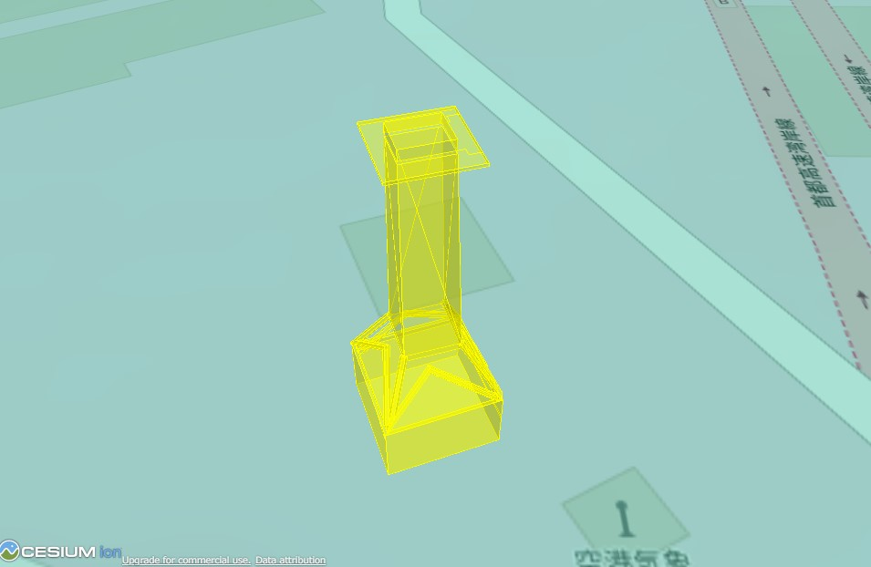
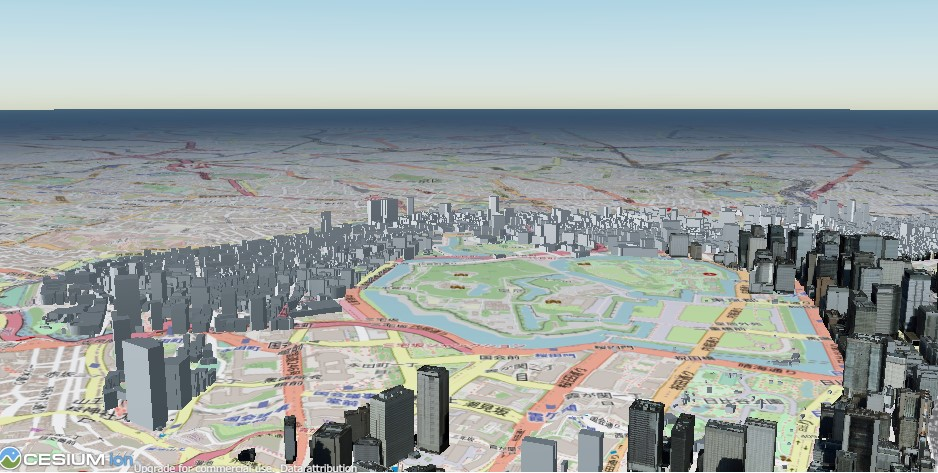

3D都市空間モデルビューワー
====

### Cesium
3D都市空間モデルの表示に[Cesium GS社](https://cesium.com/)の「Cesium ion」や「CesiumJS」を使用します
「Cesium ion」は、3D地理空間データのためのプラットフォームです。「CesiumJS」は3D地理空間データを視覚化するためのオープンソースのJavaScriptライブラリです

CesiumJSの利用方法等はチュートリアルやドキュメントを参照してください。
* [CesiumJS (チュートリアル)](https://cesium.com/learn/cesiumjs-learn/)
* [CesiumJS (ドキュメント)](https://cesium.com/learn/cesiumjs/ref-doc/Viewer.html)
* [GIS実習オープン教材 - Cesium入門](https://gis-oer.github.io/gitbook/book/materials/web_gis/Cesium/Cesium.html)

#### Cesium Access Token取得
CesiumJSを使用する為にはAccess Tokenを取得する必要があります。  
Cesium ionのアカウントを作成して、ログイン後にAccess TokensメニューからAccess Tokensを取得します。非商用の個人プロジェクト、研究、非営利の教育活動目的であれば無料です。

[Cesium ion アカウント作成](https://cesium.com/ion/signup/)

### CesiumJSで3D地理空間データの可視化
Access Tokensを取得しmain.jsの「your_access_token」を書き換えてください。

main.js
```
Cesium.Ion.defaultAccessToken = 'your_access_token';
```

#### GeoJSONファイル
GeoJSONを表示させます
```
$ cd geojson
$ python -m http.server 8000
https://127.0.0.1:8000/でアクセス
```
表示例


#### 3DTiles形式のデータ
3D tiles形式のデータを表示させます
```
$ cd 3dtiles
$ python -m http.server 8000
https://127.0.0.1:8000/でアクセス
```

表示例


### ワンライナーWebサーバ
CesiumJSの動作確認をする場合は、ワンライナーWebサーバを使用するとよいと思います。ワンライナーWebサーバを起動させて、Webブラウザーから動作確認をしてみてください

起動後、Webブラウザーで下記にアクセスしてください。  
https://127.0.0.1:8000/

#### Python3
Python3は下記で起動させます

```
ワンライナーWebサーバ起動
$ python -m http.server 8000
```
#### node.js（http-server）
node.js（http-server）は下記で起動させます

http-serverをグローバルインストール
```
インスト―ル
$ npm install -g http-server

ワンライナーWebサーバ起動
$ http-server -p 8000
```

http-serverをローカルインストール
```
インスト―ル
$ npm install http-server

ワンライナーWebサーバ起動
$ ./node_modules/.bin/http-server -p 8000
```

### PLATEAUデータの表示
PLATEAUデータの可視化は下記を参考にしてください

* [PLATEAU配信サービス（試験運用）-チュートリアル](https://github.com/Project-PLATEAU/plateau-streaming-tutorial)
* [3D都市モデル（Project PLATEAU）ポータルサイト](https://www.geospatial.jp/ckan/dataset/plateau)
    - Project PLATEAUが新たに取得したオルソ航空写真はG空間情報センターからGeoTIFF形式で入手可能

| データセット     | 説明                        | チュートリアル                |
|:----------------|:----------------------------|:----------------------------|
| PLATEAU-3DTiles | 建築物モデル等の3DTilesデータ | plateau-3dtiles-streaming   |
| PLATEAU-Terrain | 地形モデルのTerraindbデータ	  | plateau-terrain-streaming   |
| PLATEAU-Ortho   | 航空写真オルソ画像タイルデータ | plateau-ortho-streaming     |

* [PLATEAU-3DTiles配信チュートリアル (plateau-3dtiles-streaming)](https://github.com/Project-PLATEAU/plateau-streaming-tutorial/blob/main/3d-tiles/plateau-3dtiles-streaming.md)
* [PLATEAU-Terrain配信チュートリアル (plateau-terrain-streaming)](https://github.com/Project-PLATEAU/plateau-streaming-tutorial/blob/main/terrain/plateau-terrain-streaming.md)
* [PLATEAUオルソ配信チュートリアル (plateau-ortho-streaming)](https://github.com/Project-PLATEAU/plateau-streaming-tutorial/blob/main/ortho/plateau-ortho-streaming.md)
